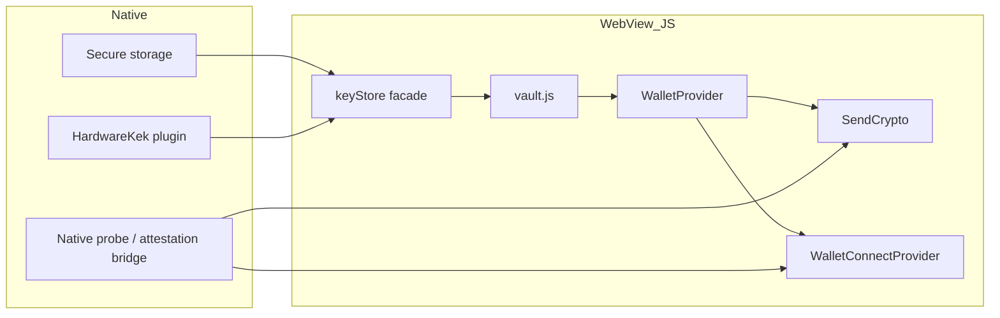
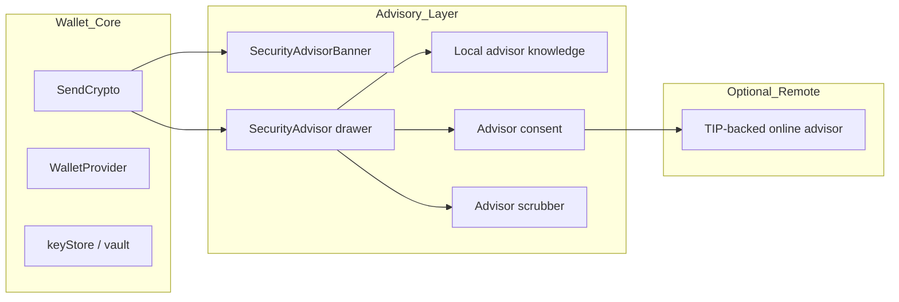

# Veyrnox Mobile Security Architecture

**Status:** implementation-backed architecture note  
**Date:** August 21, 2026  
**Scope:** current mobile code paths, trust boundaries, threat model, and the AI Security Advisor's role  
**Primary sources:** `src/wallet-core/keystore/*`, `src/wallet-core/vault.js`, `src/lib/WalletProvider.jsx`, `src/pages/SendCrypto.jsx`, `src/lib/WalletConnectProvider.jsx`, `src/components/SecurityAdvisor.jsx`

This document describes the **mobile security architecture as it is implemented in code today**. It is intentionally narrower and more concrete than the broader product security docs: the goal is to explain how the iOS/Android app actually protects secrets, where the trust boundaries are, where signing happens, and where the AI Security Advisor fits.

The most important honest framing is:

- Native hardware is used to strengthen **vault access** and **at-rest protection**
- The unlocked mnemonic still enters the app's JS runtime while the wallet is open
- Transaction signing is still performed in the **JS/WebView path**, not in a fully native signer
- The AI Security Advisor is **advisory-only** and sits outside the custody/signing trust core

---

## 1. Executive Summary

Veyrnox mobile is a self-custodial wallet running in a Capacitor shell. The seed is encrypted locally in a vault, unlocked through a keystore abstraction, and held transiently in memory while the wallet is open. Native code strengthens the unlock path by providing secure storage and, for KEK-enrolled vaults, a device-bound hardware factor. Once unlocked, `WalletProvider` derives per-chain keys on demand for EVM, BTC, and SOL operations.

The architecture is therefore best described as:

- **Strong local encrypted storage**
- **Native hardware-assisted vault unlock**
- **Policy-heavy, fail-closed transaction gating**
- **JS-resident unlocked session and JS signing**

That is stronger than a plain password-only wallet, but it is not yet a full native-signing architecture.

---

## 2. Core Security Model

The mobile security model is built around four layers:

1. **Encrypted vault at rest**
2. **Native-gated unlock**
3. **Transient in-memory unlocked session**
4. **Sign-time enforcement and risk gating**

### 2.1 Encrypted vault at rest

The vault format is defined in [src/wallet-core/vault.js](/Users/aljobson/Documents/GitHub/veyrnox/src/wallet-core/vault.js).

Current implementation:

- KDF: Argon2id
- Cipher: AES-256-GCM
- Current KDF parameters for new vault writes:
  - `memorySize = 196608` KiB (192 MiB)
  - `iterations = 3`
  - `parallelism = 1`
  - `hashLength = 32`
- Vault headers are authenticated with AAD via `vaultAad(...)`

The vault module also enforces:

- sanity bounds on stored/imported KDF parameters
- strict base64 field validation
- authenticated header binding via AAD
- fail-closed handling of malformed vaults versus wrong credentials

This is the base cryptographic storage layer for both web and native.

### 2.2 Native-gated unlock

The platform storage seam is selected in [src/wallet-core/keystore/index.js](/Users/aljobson/Documents/GitHub/veyrnox/src/wallet-core/keystore/index.js).

- On web, `webKeyStore` is used
- On native, the app lazy-loads `native.js`

The native implementation lives in [src/wallet-core/keystore/native.js](/Users/aljobson/Documents/GitHub/veyrnox/src/wallet-core/keystore/native.js).

That module changes two important things versus the plain web path:

- ciphertext is persisted through native secure storage rather than ordinary web storage
- KEK-enrolled vaults require a native hardware factor during unlock

### 2.3 Transient in-memory unlocked session

The unlocked wallet session is managed by [src/lib/WalletProvider.jsx](/Users/aljobson/Documents/GitHub/veyrnox/src/lib/WalletProvider.jsx).

Important facts from the implementation:

- the decrypted mnemonic is kept in memory, not persisted
- the mnemonic is intentionally held outside React state
- `lock()` clears live session material best-effort
- `withPrivateKey`, `withBtcPrivateKey`, and `withSolPrivateKey` derive keys only when needed for signing

This is the app's real unlocked-session trust boundary.

### 2.4 Sign-time enforcement

The send chokepoint is [src/pages/SendCrypto.jsx](/Users/aljobson/Documents/GitHub/veyrnox/src/pages/SendCrypto.jsx).

At sign time, it re-checks:

- recipient format
- amount format
- seed-verification preconditions
- spend limits
- transaction risk scoring
- fresh RASP status
- optional second-factor gates

WalletConnect has its own hardened signing boundary in [src/lib/WalletConnectProvider.jsx](/Users/aljobson/Documents/GitHub/veyrnox/src/lib/WalletConnectProvider.jsx).

---

## 3. Threat Model

### 3.1 Protected assets

The primary assets in the mobile architecture are:

- BIP-39 mnemonic / recovery seed
- derived private keys for EVM, BTC, and SOL
- vault ciphertext blob
- KEK / DEK material during unlock, enroll, rotation, and restore
- deniability-related state
- transaction authorization state
- AI Security Advisor free-text input and context payloads

### 3.2 Trust boundaries

The code implies these trust boundaries:

- **More trusted**
  - device secure storage
  - native hardware capability
  - OS biometric prompt UX
- **Less trusted**
  - WebView JS runtime
  - RPC responses
  - WalletConnect peers
- **Explicitly untrusted**
  - backend/network for key custody
  - third-party dApps
- **Optional external boundary**
  - remote AI advisor/TIP-backed answer path, only after explicit consent

### 3.3 Threats considered

The current implementation directly addresses these threats:

- device theft and offline ciphertext extraction
- malformed or corrupted vault storage
- rooted / hooked / emulated environment
- stale UI state bypassing sign-time controls
- malicious WalletConnect payloads
- malicious or dishonest RPC responses
- biometric re-enrollment invalidating hardware state
- coercion / duress exposure
- secret leakage through AI advisor chat

### 3.4 Residual threats

The architecture still carries these residuals:

- EVM signing still materializes key material in JS/WebView memory
- JS zeroization is best-effort, not guaranteed
- a fully compromised device can outrun app-layer protections
- RASP is a gating layer, not a full substitute for native signing enforcement

---

## 4. Storage and Vault Architecture

### 4.1 Vault cryptography

The cryptographic vault is implemented in [src/wallet-core/vault.js](/Users/aljobson/Documents/GitHub/veyrnox/src/wallet-core/vault.js).

For standard vaults:

- a password/PIN-derived key is generated with Argon2id
- the mnemonic or vault payload is encrypted under AES-GCM
- the blob stores `v`, `kdf`, `salt`, `iv`, and `ct`
- AAD binds header fields into the GCM authentication tag

The module also supports KEK/DEK variants and AAD-aware migration handling.

### 4.2 Native storage seam

The native keystore branch in [src/wallet-core/keystore/native.js](/Users/aljobson/Documents/GitHub/veyrnox/src/wallet-core/keystore/native.js) provides:

- `createVault(...)`
- `unlock(...)`
- `saveVaultContents(...)`
- `changePassword(...)`
- `enrollKek(...)`
- `unenrollKek(...)`
- personal-backup share export/restore helpers

The important architectural property is that **vault ciphertext is persisted through the native secure-storage path**, while the unlocked plaintext is returned only transiently to the app.

### 4.3 Fail-closed storage behavior

Across `vault.js`, `native.js`, and `kek.js`, the code consistently:

- rejects malformed vault blobs before deriving keys
- rejects malformed or absent `kekSalt`
- distinguishes structural corruption from wrong-credential failure
- refuses silent downgrade from KEK-protected to bare vault format
- clears stale DEK-cache state on KEK-changing paths

---

## 5. Native Hardware and KEK Architecture

### 5.1 Hardware-factor bridge

The JS/native boundary for the hardware factor lives in [src/wallet-core/keystore/hardware.js](/Users/aljobson/Documents/GitHub/veyrnox/src/wallet-core/keystore/hardware.js).

That module is the cross-platform facade to the native `HardwareKek` plugin and enforces:

- native-only access
- strict output validation
- stable machine-coded failure paths
- fail-closed handling of biometric cancel, invalidation, and missing hardware factor

### 5.2 Platform behavior

Per the actual code comments and normalization layer:

- **Android**
  - uses Android Keystore-backed hardware factor generation
  - StrongBox is preferred, but not universally guaranteed
  - insecure or unverifiable tiers are refused at enrollment time
- **iOS**
  - uses Secure Enclave-backed native behavior
  - the normalized tier is treated as `SecureEnclave`

### 5.3 KEK derivation model

The KEK construction lives in [src/wallet-core/keystore/kek.js](/Users/aljobson/Documents/GitHub/veyrnox/src/wallet-core/keystore/kek.js).

The implemented model is:

```text
H = hardware factor from native platform path
C = password/PIN-derived factor
KEK = HKDF(H || C)
DEK wrapped under KEK via AES-GCM
```

Both factors are required. The code refuses:

- missing `H`
- missing `C`
- wrong-length inputs
- degenerate all-zero inputs

This is the critical protection that makes KEK-enrolled vaults stronger than plain password-only vaults.

### 5.4 KEK enrollment and rewrap behavior

In [src/wallet-core/keystore/native.js](/Users/aljobson/Documents/GitHub/veyrnox/src/wallet-core/keystore/native.js):

- `enrollKek(...)` verifies the password first, then creates the KEK-wrapped vault form
- `saveVaultContents(...)` preserves the existing KEK wrap while updating vault contents
- `changePassword(...)` rotates KEK binding without silently downgrading vault format
- `unenrollKek(...)` converts a KEK vault back to a bare vault only after successful re-encryption

This is an important implementation detail: the code is designed so that content changes do not accidentally strip hardware protection.

---

## 6. Unlocked Session and Key Handling

The unlocked session is managed in [src/lib/WalletProvider.jsx](/Users/aljobson/Documents/GitHub/veyrnox/src/lib/WalletProvider.jsx).

### 6.1 Mnemonic lifetime

The mnemonic is:

- decrypted after successful unlock
- stored transiently in memory
- intentionally kept out of ordinary React state
- cleared on lock best-effort

This is a conscious minimization strategy, but it is **not** equivalent to native-memory isolation.

### 6.2 Key derivation on demand

`WalletProvider` exposes:

- `withPrivateKey(...)` for EVM
- `withBtcPrivateKey(...)` for BTC
- `withSolPrivateKey(...)` for SOL

These functions derive keys only for the duration of a callback.

Important honesty point from the code:

- BTC and SOL use `Uint8Array` values that are zeroed in `finally()`
- EVM private keys are still JS strings, so zeroization is structurally weaker

This means Veyrnox mobile is **not yet a native-signing architecture**.

---

## 7. Signing and Transaction Security

### 7.1 EVM signing path

EVM send logic lives in [src/wallet-core/evm/send.js](/Users/aljobson/Documents/GitHub/veyrnox/src/wallet-core/evm/send.js).

It:

- receives a transient private key from `WalletProvider`
- constructs an `ethers.Wallet`
- verifies live chain ID against the intended network
- estimates gas and sanity-checks nonce
- signs locally and broadcasts

The key architectural consequence is simple:

- **EVM signing still occurs in JS**

### 7.2 Send chokepoint

The primary send chokepoint is [src/pages/SendCrypto.jsx](/Users/aljobson/Documents/GitHub/veyrnox/src/pages/SendCrypto.jsx).

Before a send is allowed, the code re-evaluates:

- address validity
- amount validity
- seed verification requirement
- transaction limits
- transaction-risk score
- fresh RASP verdict
- optional biometric/2FA conditions

This is important because the security boundary is not the button state; it is the sign-time mutation path.

### 7.3 Fresh-at-sign RASP

Fresh RASP sampling is implemented in [src/rasp/getFreshRaspArtifact.js](/Users/aljobson/Documents/GitHub/veyrnox/src/rasp/getFreshRaspArtifact.js).

It:

- re-samples native probe state at sign time
- optionally samples attestation with a bounded timeout
- fails closed on timeout, throw, or shape drift

This reduces stale-probe bypasses where an environment changes after the last UI sample but before signing.

### 7.4 WalletConnect

WalletConnect signing is independently hardened in [src/lib/WalletConnectProvider.jsx](/Users/aljobson/Documents/GitHub/veyrnox/src/lib/WalletConnectProvider.jsx).

Controls include:

- pre-sign RASP gating
- session-expiry enforcement
- address binding for `personal_sign`
- chain binding for typed-data requests
- gas and fee cap logic

This makes WalletConnect a separate signing trust boundary, not just a UI overlay.

---

## 8. Deniability and Session-Sensitive Behavior

Deniability is not fully described here, but it affects the mobile security architecture in two important ways:

- the unlocked session can represent real, decoy, or hidden wallet state
- certain external or advisory surfaces must be suppressed or made set-blind

This shows up in implementation through:

- deniability session state surfaced from `WalletProvider`
- local-only behavior in sensitive UI surfaces
- suppression of some remote surfaces when deniability/demo is active

The architectural implication is that some mobile features are judged not only by confidentiality/integrity, but also by whether they create **wallet-set or session-type oracles**.

---

## 9. AI Security Advisor

The AI Security Advisor is a real shipping feature, but it is **not** part of the custody or signing trust core.

Its function is advisory:

- explain transaction risk
- answer security questions
- provide contextual guidance
- optionally use remote TIP-backed answers if the user explicitly opts in

### 9.1 Architecture placement

The bridge used by pages to communicate with the advisor is [src/lib/advisorBridge.js](/Users/aljobson/Documents/GitHub/veyrnox/src/lib/advisorBridge.js).

That bridge:

- publishes non-secret live context
- opens the advisor drawer with an optional preloaded question
- performs no persistence and no network itself

The advisor is therefore a **global advisory surface**, not a signing participant.

### 9.2 Two advisor-related surfaces

There are two adjacent advisor surfaces in the code:

- [src/components/SecurityAdvisorBanner.jsx](/Users/aljobson/Documents/GitHub/veyrnox/src/components/SecurityAdvisorBanner.jsx)
  - local threat-intel warning banner in the send flow
- [src/components/SecurityAdvisor.jsx](/Users/aljobson/Documents/GitHub/veyrnox/src/components/SecurityAdvisor.jsx)
  - chat-style AI Security Advisor, branded as Vigil

The banner is local and synchronous. The drawer/chat can use local knowledge or, when permitted, remote TIP-backed answers.

### 9.3 Security properties

The AI Security Advisor is:

- advisory-only
- outside the custody trust root
- not a source of signing authority
- not allowed to hold keys
- not allowed to authorize transactions

### 9.4 Advisor-specific controls

The codebase adds several protections around this surface:

- explicit remote-consent gate in `src/lib/advisorConsent.js`
- input scrubbing in `src/lib/advisorScrubber.js`
- local knowledge fallback in `src/lib/advisorKnowledge.js`
- deniability/demo suppression described in `src/lib/featureCatalogue.js`
- panic-wipe cleanup of advisor-consent residue in `src/wallet-core/panic.js`

This means the main security concern for the AI advisor is **unwanted egress**, not key misuse.

### 9.5 Architectural conclusion for the advisor

The best concise description is:

> The AI Security Advisor is a context-aware, advisory-only security assistant with local fallback and optional consented remote answers, outside the wallet's key-custody and signing boundary.

---

## 10. Component and Trust-Boundary Diagrams

### 10.1 Core mobile architecture

```mermaid
flowchart TD
    U[User PIN / Password] --> C[Argon2id-derived factor C]
    H[Native hardware factor H] --> K[HKDF H||C -> KEK]
    C --> K
    K --> W[unwrap DEK / wrap DEK]
    W --> V[Vault decrypt/encrypt AES-256-GCM]
    V --> M[Mnemonic in WalletProvider memory]
    M --> E[derive EVM key on demand]
    M --> B[derive BTC key on demand]
    M --> S[derive SOL key on demand]
    E --> ES[JS signing path]
    B --> BS[JS signing path]
    S --> SS[JS signing path]
    ES --> RPC1[RPC broadcast]
    BS --> RPC2[RPC broadcast]
    SS --> RPC3[RPC broadcast]
```

### 10.2 Native and WebView boundary



### 10.3 AI Security Advisor placement



---

## 11. Review Summary

### 11.1 What the current code gets right

- Strong encrypted local storage
- KEK-aware native vault unlock
- careful malformed-input and fail-closed handling
- sign-time policy revalidation instead of trusting UI state
- fresh-at-sign RASP sampling
- WalletConnect-specific hardening
- AI advisor isolation from custody and signing roles

### 11.2 The single most important honest limitation

The current mobile architecture still allows unlocked mnemonic-derived signing material to enter the JS/WebView runtime during active wallet use.

That means the app is best described as:

- **native-unlock / native-KEK / JS-signing**

and not yet:

- **native-signing / native-isolated-key-use**

### 11.3 Likely future strengthening path

The clearest next architectural upgrade would be moving signing enforcement and key use into a native signer boundary, so that:

- the sign/refuse decision is enforced natively
- the WebView never receives live EVM private-key material
- RASP and attestation become enforcement-adjacent rather than only gating signals

Until then, the mobile architecture remains strong on at-rest protection and unlock hardening, but only partial on post-unlock JS isolation.
